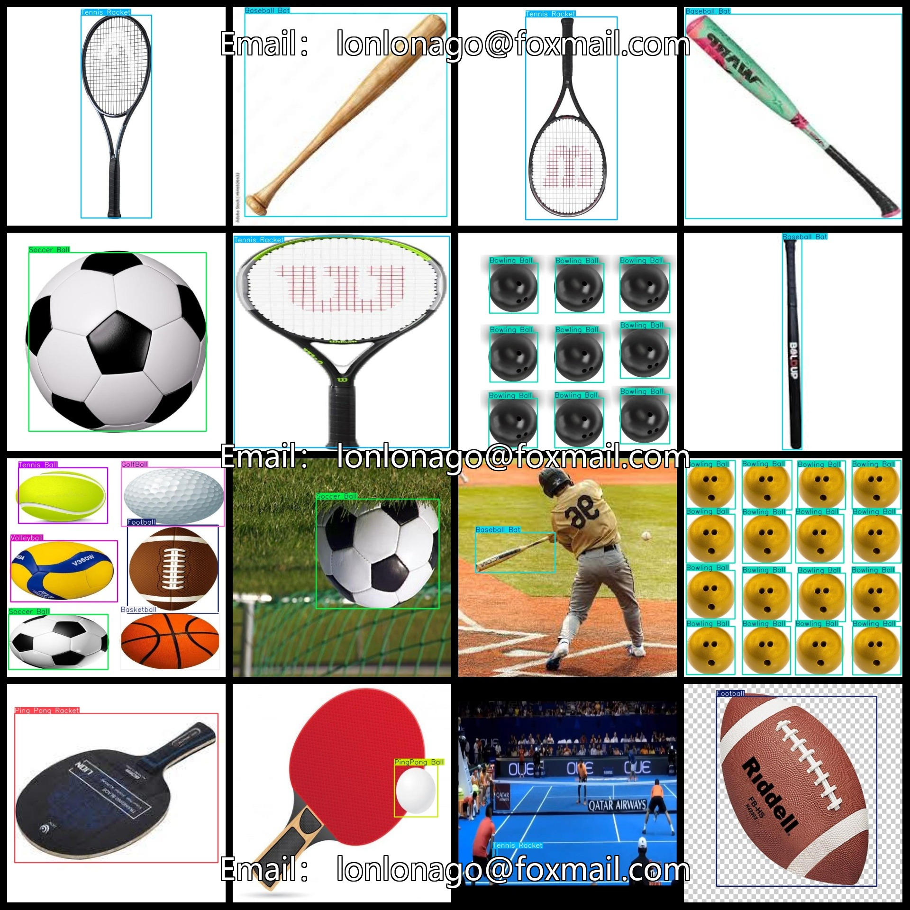

# [Object Detection] All Kinds of Motion Spheres and Equipment Detection Dataset 3300 Images YOLO+VOC Format

【Object Detection】A variety of sports ball and equipment detection datasets with 3300 images in YOLO+VOC format.

Dataset Format: Pascal VOC + YOLO (excluding the split-path txt file; only jpg images with corresponding VOC-format xml files and YOLO-format txt files)

The zip file contains 3 folders, each storing images, xml and txt files.

Total of 3300 JPEG images in the JPEGImages folder.

The total number of XML files in the Annotations folder is 3300.

The total number of txt files in the labels folder is 3300.

Number of tag types: 12.

Label Names: ["Baseball", "Baseball Bat", "Basketball", "Bowling Ball", "Football", "GolfBall", "Ping Pong Racket", "PingPong Ball", "Soccer Ball", "Tennis Ball", "Tennis Racket", "Volleyball"]

[ "Baseball", "Batting Gloves", "Basketball", "Bowling", "Football", "Golf", "Ping Pong Paddle", "Ping Pong Ball", "Rugby Football", "Tennis", "Tennis Racket", "Volleyball" ]

Number of boxes per label (Note that the YOLO format may differ from this, as confirmed by the labels folder's classes.txt):

- Baseball frame count = 1309
- Baseball Bat frame count = 1127
- Basketball frame count = 1312
- Bowling Ball frame count = 1230
- Football frame count = 1380
- GolfBall frame count = 1038
- Ping Pong Racket frame count = 846
- PingPong Ball frame count = 1569
- Soccer Ball frame count = 982
- Tennis Ball frame count = 879
- Tennis Racket frame count = 1038
- Volleyball frame count = 933

Total frame count: 13643.

Image clarity (resolution: pixels): Clear.

Image enhancement: Yes.

Tag shape: rectangle, used for target detection recognition.

Important Notice: No.

Special Disclaimer: This dataset does not guarantee the accuracy or precision of the training model or weight files, and only provides accurate and reasonable annotations.
## Images

---

Here is a pay link on Stripe (https://buy.stripe.com/3cs8yP7sY87d0vu9AB). Please contact me lonlonago@foxmail.com after funding $89, and I will send you a complete data files, thank you!

